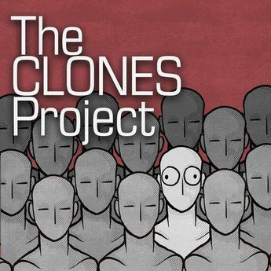
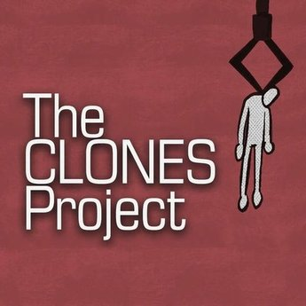
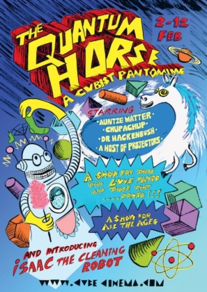

# Performance skills & history

In my performance skills, I like to believe I am equally good off stage as I am on. I enjoy the focus of listening to my fellow performers and being able to react in the moment. Improv does not always have to be "funny", it can also be poignant, and emotional to tell a story. Being a nerd I'm good at using technology in ways to either help the production of a show or be included in a show. Even if that means I have to program something myself.

Do [get in touch](mailto:me@catharsis.co.uk) if you want to talk to me about any of the following:

* Public speaking
* Voice over
* Compere/Toast Master
* Improvised theatre
* Devised theatre
* Tabletop RPG facilitation

## Ongoing work

### The Clones Project

 

[Artwork by N J Adam](https://www.instagram.com/njadamart/)

Take a glimpse into a futuristic society where everybody is designated several Clones and still expected to navigate the pitfalls and hazards of the modern workplace. Presented by the Founder and CEO of the U Foundation, our showcase will demonstrate the myriad of benefits and uses of the New U technology to you, our investors. Inspired by Bladerunner and the TTRPG Paranoia, Clones is an improvised Sci-Fi show unlike any other, except itself, of course.

**Position Held:** Director & Performer

**Concept:** How would we as humans be different if we knew we could die and come back a certain number of times.

**Get:** We ask the audience for a workplace or career tro base our show in.

### What Happened in the Interval

This reflexive show was devised as part of the Unscripted Players program in 2024 and looks to continue to evolve. We meet two people and witness parts of their lives in small vignettes as they sit and wait for the show to start. But not all is right with this relationship. It could be by sheer coincidence or the magic of theatre that the show holds a mirror up to their relationship and hints at how their life could change if one or both of them change. The message is so effective that they never see the show's end.

We find out what changes within them, and how it affects their lives as we answer the question of What Happened in the Interval

**Position Held:** Director & Performer

**Get:** We ask the audience to write down names of theatre plays that do not exist and before the show starts. We also take a relationship from the audience of the two people who would go and see a piece of theatre together.

## Past work

### Audio

#### Dec 2022 - [Hamlet by Ergo Phizmiz](https://ergophizmizmusic.bandcamp.com)

I worked with Ergo on The Quantum Horse and this is a radio soap opera that currently airs in Australia on an independent radio station called Diffusion FM. Hamlet is a radio soap opera similar to The Archers but a lot more odd. I play several parts in the play which include

* Malcolm Blood - Upper-class landowner with a slightly northern twang
* Jeremy Braverman - Soft neutral voice with a camp undertone
* George (a little boy) - Squeeky and disapproving
* Steven the Parrot - Typical "pieces-of-eight" style parrot voice
* Ronan - Loud, brash, talks about poo a lot
* Farmer Jarman - South-west UK drawl with a tendency to mumble

### Jan 2019 - July 2023 - [Rough Sketch Podcast](https://shows.acast.com/rough-sketch-podcast)

Since I re-embraced the performing side of my personality I wanted to create a podcast that involved an element of improvisation in it and that is how Rough Sketch was born. I set a goal of putting one episode out per month and during my first year, I was lucky enough to get quite a few guests scheduled so I put out more episodes than originally scheduled.

I put a lot of work into this project. I schedule the guests, edit the audio and update the majority of the social media and love doing it.

The podcast is currently on a hiatus as I don't have the time to dedicate to it, the last episode was released July 2023

### Video

#### TTRPG

* [Bigfoot Stole my Car - GM](https://youtu.be/D3ABrrou5m4?si=30CpuqvCHvjQeDIe)
* [F'ed up little man](https://youtu.be/9UJcrAS3X2c?si=LkgW4fzj15gv5ttl)
* Pick Me- GM [Recorded in 2023](https://www.youtube.com/watch?v=9lRBh37x8oo), [Recorded in 2024](https://www.youtube.com/watch?v=3YEI9x-gvpI)
* Edith Jackson - Call of Cthulhu character - [Part 1](https://youtu.be/JzSyl3q25nk?si=9CBCx-O3R4ovIgN9), [Part 2](https://youtu.be/MWIDO1gU5mg?si=5cUHP93RZS6LhrDu) and [Part 3](https://youtu.be/eKwUwfxzFpo?si=df5i1MjQdIhUXqRA)
* Keeper for Brindlewood Bay 2023 - [Part 1](https://www.youtube.com/watch?v=cp9Yl5jYDng&t=73s), [Part 2](https://youtu.be/I7t7HFqMm80?si=-IV6VMkBc384frXs) and [Part 3](https://www.youtube.com/watch?v=6odc9NDBFiQ&lc=Ugx3aEewZEqrv6T9q_p4AaABAg)
* [SuperNormal - GM](https://youtu.be/XdX7bcvlwmo?si=yQGCZXO0EkOmkIAk)
* Goblin Quest - [Recorded in 2022](https://youtu.be/IWPs5gSXzeE?si=L6VAhqWUBTb6ryYh), [Recorded in 2024](https://youtu.be/agfjh5KH88Q?si=ntiVJcvK3JlCIYcz)
* [All Outta BubbleGum - Player](https://youtu.be/JKqf6VxV1iA?si=bhy5PLBTgllXxgXI)

#### October 2023 - [Lostferatu](https://www.youtube.com/@Lostferatu2023)

A zero-budget remake of the Lost Boys. I take on the part of "Star" specifically in the "love scene". Yes, I didn't get paid for it and yes it was stupidly fun.

### Stage

#### February 2023 - [The Quantum Horse by Ergo Phizmiz](https://ergophizmizmusic.bandcamp.com)

The Quantum Horse is a Pantomime written and directed by [Ergo Phizmiz](https://ergophizmizmusic.bandcamp.com). I attended an initial meeting in December 2022 and threw myself into the project. After a mad January of some major script changes and my parts in the panto expanding from one character to four, it was a great way to start the year.

The show had a run of 8 performances with the majority of them being sold out to a 100+ audience between 02nd Feb & 12th Feb at [The Cube Microplex](https://cubecinema.com/) in Bristol with evening performances on Thurs & Friday and matinee performances over the weekend.

**Parts I Played**

* Narrator 2 - One of the two narrators that start the show, a neutral clear and present voice
* Genie of Economy - A genie trapped for 10,000 years in the power of two metal coins - A loud theatrical overexaggerated voice
* Mr Hungerdunger - A man seeking help for his horse (Geoffrey) - Well-spoken RP with a penchant for repeating the phrase "what what"
* Digital Projector - An embodiment of a digital projector at The Cube Microplex - South-west Bristolian accent

**Reviews**

> I went, it was excellent - [BarrySqiggle via Reddit](https://www.reddit.com/r/bristol/comments/10rsipy/comment/j768pb2/?utm_source=reddit&utm_medium=web2x&context=3)

> Brilliantly written, acted and produced - [Leander Morrison via Twitter](https://twitter.com/LeandaMorrison/status/1623961667250823171)

> Queer and neurodivergent audience members will appreciate it on about twelve different levels - [Quill via Website](https://www.cuillioc.org/0/partnerships/Reviews/review-quantum-horse)

#### April 2022 - Good Morning Bristol

Another production by the [Unscripted Players](https://www.facebook.com/unscriptedplay/) directed by Aiden Pope was delayed by two years due to COVID-19. The show was essentially poking fun at the traditional Morning TV show e.g. Good Morning Britain. Short-form games were strung together by hosts that changed on a performance-by-performance basis. I was one of the team of 5 performers and performed in all three performances, taking the hosting role for one of them.  

#### March 2021 - December 2021 - The Documentary

[The Documentary](https://improv.fandom.com/wiki/The_Documentary) is an Improv form created by Billy Merritt at the Upright Citizens Brigade Theatre in 2002. I learned about it via a course held by The Nursery Theatre. After taking the course I wanted to get a team together to make an Online show of it using Zoom. It took a few months of working through the format with a team of players before we performed our first live show to an audience of around 40 people. We repeated the show a couple more times throughout the year and donated £155 to Bristol Mind. I'm currently unsure if I am going to do it again in 2022 as most people seem to want to return to performing in the physical world. Feel free to [get in touch](mailto:me@catharsis.co.uk) if you want to know more.

#### December 2020 - Deconstruction Showcase

As part of a six-week programme learning this format, I appeared in the Deconstruction Showcase with The Nursery Theatre. I had never heard of this format before but I'm always eager to look into more formats of Improv. The format was taught by the wonderful [Jen Rowe](http://www.jennyrowe.co.uk/) and at the end of it we performed as a live Facebook event which was recorded. You can watch the recording on the [Nursery Theatre Facebook page](https://www.facebook.com/336623673035352/videos/851870432298250/).

#### July 2019 - Origin of Heroes

This production was my Improv directorial debut and put on as part of the [Unscripted Players](https://www.facebook.com/unscriptedplay/) Big July Show. I had the idea that you could create a show where we improvise the creation of the hero's origin story. It was a cast of six and we rehearsed for 8 weeks to find good ways to put the various beats of the show together.

Each week I would choose a few Improv-based activities to warm up and then focus on versions of a particular beat to give the players the tools they need.

During the show I played the part of the "narrator", taking on the name Lee Stanley a play on words of the late great Stan Lee. My job was to introduce the cast, take the suggestions from the audience and every now and then re-cap the story to help the players know where to focus.

I aim to hopefully put together a plan to take this show on the road and hit the Edinburgh Fringe.

#### April 2019 - The Stuff of Dreams

The Stuff of Dreams was Directed by Catherine Murphy and put on as part of the [Unscripted Players](https://www.facebook.com/unscriptedplay/) Big April Show. It aimed to explore the messages that can be contained within our dreams. Scenes would take place in either the dream world where we could use tools like Scene Painting to make anything happen. Our job as players was to take the elements that appeared in the Dreamworld and weave them into the narrative story.

### July 2018 - What a Difference A Friend Makes

What a Difference A Friend Makes was Directed by Llaura Hughes and put on as part of the [Unscripted Players](https://www.facebook.com/unscriptedplay/) Big July Show. It was a narrative piece and aimed to explore the relationships we make in our journey through life and the things that our friends do that enhance our lives.

#### February 2017 - Bar Wotever

My venture into queer cabaret. I have written some odd poetry in the past and now and then I like to unleash it onto the world. Bar Wotever is a club/cabaret night that usually takes place in Vauxhall (London) but they did a small tour and held a three-night stint in Bristol and I was glad to be part of it.

## Links

* [Back to main](/)
